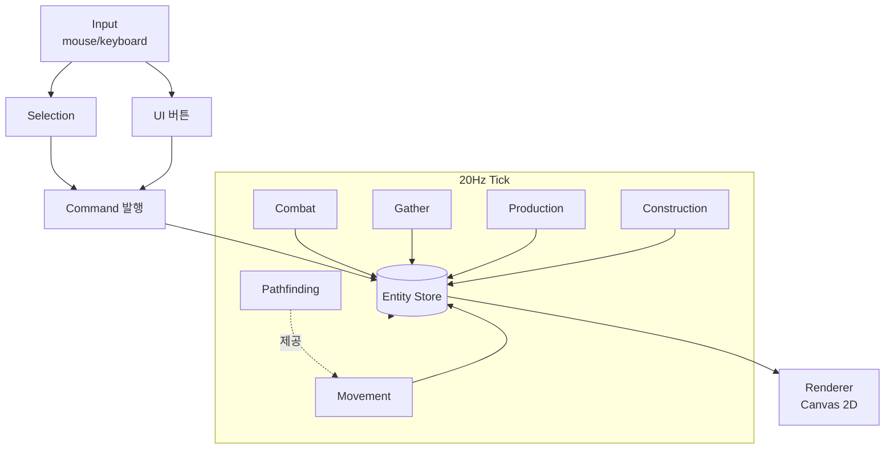

# RTS MVP 설계 문서

## 1. 개요

간단한 StarCraft 스타일 RTS의 MVP. 본 문서는 게임 로직의 기반(선택→명령→이동→자원→생산→건설→전투)을 **단계별로 검증 가능한 형태**로 구현하기 위한 설계서다. 이번 MVP의 일차 목적은 재미가 아니라 **"기반 로직이 제대로 작동하는지 단계별 검증"**.

향후 1:1 Player vs Computer를 지향하지만, 이번 MVP에서는 **컴퓨터 AI는 제외**하고 적 진영은 정적 더미로만 둔다.

## 2. 기술 스택

- TypeScript (strict mode)
- HTML5 Canvas 2D (no game framework)
- Vite (dev server, hot reload)
- 외부 게임 라이브러리 없음 — A*, 충돌, 선택 박스 등 전부 직접 구현

선택 근거: 가벼움, 빠른 반복, 엔진 추상화 없이 RTS 핵심 시스템을 직접 작성해 검증.
PC 데스크톱 패키징은 Post-MVP에서 Tauri 등으로 래핑.

## 3. MVP 스코프

**포함**

- 단일 정사각 그리드 맵 (예: 64×64 셀, 셀=32px → 2048×2048 월드. 카메라 패닝)
- 자원 1종 (Mineral) + 자원 노드 N개
- 엔티티: Worker, Marine, CommandCenter, Barracks, Turret, MineralNode, EnemyDummy
- 입력: 좌클릭(단일 선택), 드래그(박스 선택), Shift+클릭(추가/토글), 우클릭(컨텍스트 명령)
- 컨텍스트 명령: 빈 땅→이동, 자원 노드→채취, 적/타팀 빌딩→공격, 건설중→건설 도움
- UI: 좌상단 자원 표시, 좌하단 선택 정보 + 생산/건설 버튼, 엔티티 위 HP 바, 선택 외곽선, 드래그 박스, 생산/건설 진행률

**제외**

- 컴퓨터 AI (적은 정적 더미)
- 멀티 자원, 테크 트리, 업그레이드, 안개/시야
- 사운드, 스프라이트(도형 렌더만), 미니맵, 저장/로드, 멀티플레이어

## 4. 엔티티 정의

| 엔티티 | 종류 | HP | 비용 | 생산처 | 생산시간 | 사거리 | DPS | 비고 |
|---|---|---|---|---|---|---|---|---|
| Worker | Unit | 40 | 50 | CommandCenter | 12s | — | — | 채취·건설 |
| Marine | Unit | 60 | 50 | Barracks | 15s | 5셀 | 6 | 사격 |
| CommandCenter | Building | 1500 | (시작제공) | — | — | — | — | 자원 반입, Worker 생산 |
| Barracks | Building | 1000 | 150 | Worker가 건설 | 20s | — | — | Marine 생산 |
| Turret | Building | 200 | 100 | Worker가 건설 | 15s | 6셀 | 8 | 자동 공격 |
| MineralNode | Resource | — | — | — | — | — | — | 잔량 1500 |
| EnemyDummy | Unit | 100 | — | — | — | — | — | 정지, 공격 X |

수치는 초안. Phase 8 완료 후 밸런싱.

## 5. 핵심 시스템 개요

1. **Game Loop** — `requestAnimationFrame` 기반. 고정 20Hz 시뮬레이션 + 가변 렌더, dt 분리.
2. **Entity Store** — `Map<id, Entity>`. 공통 필드(`id, kind, team, pos, hp`) + kind별 필드.
3. **Map / Grid** — 셀 점유 정보. 건물 = 정적 장애물.
4. **Selection** — 마우스다운→박스→마우스업, 또는 단일 클릭. Shift는 추가/토글.
5. **Command** — 선택 유닛에 명령 발행. 종류: `Move`, `Attack`, `Gather`, `Build`. 유닛은 명령 기반 상태머신.
6. **Pathfinding** — 그리드 A*. MVP에선 매 호출 계산.
7. **Gather** — Worker 채취 사이클(노드→채취→CC 반입→반복).
8. **Production** — 건물의 생산 큐. 완료 시 인접 셀 스폰 + rally point.
9. **Construction** — Worker 건설. 빌딩 "건설중" → 완료.
10. **Combat** — 사거리 내 적이 있으면 cooldown마다 데미지. 자동 획득.
11. **Renderer** — 도형 렌더. HP 바, 선택, 드래그 박스, UI 오버레이.

## 6. 데이터 흐름



## 7. 구현 Phase

각 phase는 **그 단계만 끝내면 실행해서 눈으로 검증할 수 있는** 단위. 한 phase의 검증 체크리스트가 모두 통과하기 전에는 다음 phase로 넘어가지 않는다.

### Phase 0 — 부트스트랩

**목표**: Vite + TS 프로젝트 구동, 빈 캔버스 + fps/tick 카운터.
**추가 파일**: `package.json`, `tsconfig.json`, `vite.config.ts`, `index.html`, `src/main.ts`, `src/game/loop.ts`.
**검증**

- [ ] `npm run dev` 후 페이지가 뜨고 캔버스 보임
- [ ] fps 카운터 ~60
- [ ] 별도의 20Hz 시뮬레이션 tick 카운터가 일정한 간격으로 증가

### Phase 1 — 맵 + 정적 엔티티 렌더

**목표**: 허허벌판 그리드 맵 + CommandCenter, Worker 1, Marine 1, MineralNode 몇 개, EnemyDummy 1을 정적으로 배치. 카메라 패닝(WASD/화살표).
**추가 파일**: `src/types.ts`, `src/game/world.ts`, `src/game/entities.ts`, `src/game/camera.ts`, `src/render/renderer.ts`.
**검증**

- [ ] 그리드 라인이 보임
- [ ] 각 엔티티가 정해진 위치에 적절한 도형/색으로 보임 (원=유닛, 사각=건물, 팀별 색)
- [ ] WASD/화살표로 카메라 이동, 스크린↔월드 좌표 변환 정상

### Phase 2 — 선택

**목표**: 좌클릭 단일 선택, 드래그 박스 다중 선택, Shift 추가/토글, 빈 곳 클릭 시 해제. 선택 표시(외곽 링).
**추가 파일**: `src/game/input.ts`, `src/game/selection.ts`. Renderer에 선택/박스 오버레이 추가.
**검증**

- [ ] 단일 클릭으로 1개 선택
- [ ] 드래그 박스가 화면에 그려지고 박스 안 유닛 다중 선택
- [ ] Shift+클릭/드래그로 추가/토글
- [ ] 빈 땅 클릭 시 선택 해제
- [ ] 적 유닛/건물도 단일 선택 가능 (공격 대상 지정용)

### Phase 3 — 이동 + A*

**목표**: 우클릭 이동, 건물 회피, 다중 선택 그룹 이동.
**추가 파일**: `src/game/commands.ts`, `src/game/pathfinding.ts`, `src/game/systems/movement.ts`.
**검증**

- [ ] 빈 땅 우클릭 시 선택 유닛이 그 위치로 이동
- [ ] 건물을 우회하는 경로 산출
- [ ] 다중 선택 시 모두 이동 (formation은 X, 겹침 허용)
- [ ] 도착 후 정지, 이동 중 새 명령 시 즉시 갱신

### Phase 4 — 자원 채취

**목표**: Worker가 노드↔CC를 자동 왕복하며 자원 카운터 증가.
**추가 파일**: `src/game/systems/gather.ts`, `src/render/ui.ts`(자원 카운터만 우선).
**검증**

- [ ] MineralNode 우클릭 시 Worker가 채취 시작
- [ ] 채취 N초 → 가장 가까운 CC로 이동 → 반입 → 자원 +N → 같은 노드로 복귀
- [ ] 노드 잔량 0이면 다른 가까운 노드 자동 탐색, 없으면 정지
- [ ] 다중 Worker가 동시에 채취해도 동작

### Phase 5 — 생산: Worker

**목표**: CC에서 Worker 생산 큐. 자원 차감, 인접 셀 스폰, rally point.
**추가 파일**: `src/game/systems/production.ts`, `src/render/ui.ts` 확장.
**검증**

- [ ] CC 선택 시 "Worker 생산" 버튼 표시
- [ ] 클릭 시 자원 50 차감 + 큐 진입 (진행률 바)
- [ ] 12s 후 인접 빈 셀에 Worker 스폰
- [ ] 자원 부족 시 버튼 비활성/실패 표시
- [ ] CC 선택 후 우클릭으로 rally point 설정, 신규 Worker가 그 지점으로 이동

### Phase 6 — 건설

**목표**: Worker로 Barracks / Turret 건설. 배치 모드 → 클릭 → 건설중 → 완료.
**추가 파일**: `src/game/systems/construction.ts`. UI에 건물 종류 버튼 + 배치 미리보기.
**검증**

- [ ] Worker 선택 시 건설 버튼들(Barracks, Turret) 표시
- [ ] 버튼 클릭 시 마우스 위치에 건물 미리보기, 유효/무효 위치 색 구분
- [ ] 클릭 시 자원 차감, "건설중" 빌딩(반투명) 배치, Worker가 인접 셀로 이동해 진행
- [ ] 진행률 바 채워지고 완료 시 정상 빌딩으로 전환
- [ ] 건설중 빌딩도 점유로 인식되어 길찾기·신규 건설 배치에 반영

### Phase 7 — 생산: Marine

**목표**: Barracks에서 Marine 생산.
**추가 파일**: production 시스템 확장 + UI 버튼.
**검증**

- [ ] Barracks 선택 시 "Marine 생산" 버튼 표시
- [ ] 자원 50 차감, 15s 후 Marine 스폰
- [ ] rally point 설정 가능, 신규 Marine이 그 지점으로 이동
- [ ] 큐에 여러 개 쌓이면 순차 생산

### Phase 8 — 전투

**목표**: Marine과 Turret이 적(EnemyDummy)을 공격해 처치.
**추가 파일**: `src/game/systems/combat.ts`. Renderer에 사격 효과(짧은 라인) + HP 바.
**검증**

- [ ] EnemyDummy 우클릭 시 Marine이 사거리까지 접근 → 공격 시작
- [ ] 사거리 내 적이 들어오면 자동 공격(자동 획득)
- [ ] HP 바 감소, 0이면 엔티티 제거
- [ ] Turret은 정지 상태로 사거리 내 적을 자동 공격
- [ ] attack-move(별도 단축키 또는 Shift+우클릭) — 경로상 적 발견 시 멈춰 공격 후 재개

### Phase 9 — UI 다듬기

**목표**: 사용성 정리 — 자원/선택 패널/HP 바/생산·건설 진행률 일관화.
**추가 파일**: `src/render/ui.ts` 정리.
**검증**

- [ ] 모든 UI 요소가 카메라 패닝과 무관하게 화면 고정
- [ ] 선택 변경 시 패널이 즉시 갱신, 다중 선택 시 요약 표시
- [ ] 생산/건설 큐가 시각적으로 명확
- [ ] 키보드 단축키(예: B=Build 메뉴, A=Attack-move) 정리

## 8. 파일 구조 (최종)

```
/
├── docs/
│   └── DESIGN.md                ← 이 문서
├── index.html
├── package.json
├── tsconfig.json
├── vite.config.ts
└── src/
    ├── main.ts                  # 부트스트랩
    ├── types.ts                 # 공통 타입
    ├── game/
    │   ├── loop.ts              # 20Hz tick + 가변 렌더
    │   ├── world.ts             # entity store, map, 자원
    │   ├── entities.ts          # 엔티티 팩토리
    │   ├── camera.ts
    │   ├── input.ts             # 마우스/키보드 이벤트
    │   ├── selection.ts
    │   ├── commands.ts          # 명령 발행/디스패치
    │   ├── pathfinding.ts       # A*
    │   └── systems/
    │       ├── movement.ts
    │       ├── gather.ts
    │       ├── production.ts
    │       ├── construction.ts
    │       └── combat.ts
    └── render/
        ├── renderer.ts          # 월드 렌더
        └── ui.ts                # HUD/패널/버튼
```

## 9. 추후 확장 (Post-MVP)

- 컴퓨터 AI (간단한 빌드 오더 + 정찰 + 공격)
- 추가 유닛/건물, 업그레이드, 테크 트리
- 안개 / 시야, 미니맵
- 사운드, 스프라이트, 애니메이션
- 데스크톱 패키징 (Tauri)
- 멀티플레이어 (결정론적 lockstep)
