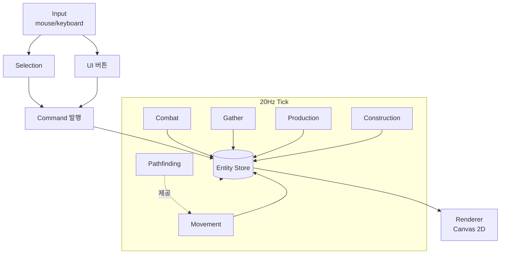

# RTS MVP 설계 문서

## 1. 개요

간단한 StarCraft 스타일 RTS의 MVP. 본 문서는 게임 로직의 기반(선택→명령→이동→자원→생산→건설→전투)을 **단계별로 검증 가능한 형태**로 구현하기 위한 설계서다. 이번 MVP의 일차 목적은 재미가 아니라 **"기반 로직이 제대로 작동하는지 단계별 검증"**.

향후 1:1 Player vs Computer를 지향하지만, 이번 MVP에서는 **컴퓨터 AI는 제외**하고 적 진영은 정적 더미로만 둔다.

## 2. 기술 스택

- TypeScript (strict mode)
- HTML5 Canvas 2D (no game framework)
- Vite (dev server, hot reload)
- 외부 게임 라이브러리 없음 — A*, 충돌, 선택 박스 등 전부 직접 구현

선택 근거: 가벼움, 빠른 반복, 엔진 추상화 없이 RTS 핵심 시스템을 직접 작성해 검증.
PC 데스크톱 패키징은 Post-MVP에서 Tauri 등으로 래핑.

## 3. MVP 스코프

**포함**

- 단일 정사각 그리드 맵 (예: 64×64 셀, 셀=32px → 2048×2048 월드. 카메라 패닝)
- 자원 1종 (Mineral) + 자원 노드 N개
- 엔티티: Worker, Marine, CommandCenter, Barracks, Turret, MineralNode, EnemyDummy
- 입력: 좌클릭(단일 선택), 드래그(박스 선택), Shift+클릭(추가/토글), 우클릭(컨텍스트 명령)
- 컨텍스트 명령: 빈 땅→이동, 자원 노드→채취, 적/타팀 빌딩→공격, 건설중→건설 도움
- UI: 좌상단 자원 표시, 좌하단 선택 정보 + 생산/건설 버튼, 엔티티 위 HP 바, 선택 외곽선, 드래그 박스, 생산/건설 진행률

**제외**

- 컴퓨터 AI (적은 정적 더미)
- 멀티 자원, 테크 트리, 업그레이드, 안개/시야
- 사운드, 스프라이트(도형 렌더만), 미니맵, 저장/로드, 멀티플레이어

## 4. 엔티티 정의

| 엔티티 | 종류 | HP | 비용 | 생산처 | 생산시간 | 사거리 | DPS | 비고 |
|---|---|---|---|---|---|---|---|---|
| Worker | Unit | 40 | 50 | CommandCenter | 12s | — | — | 채취·건설 |
| Marine | Unit | 60 | 50 | Barracks | 15s | 5셀 | 6 | 사격 |
| CommandCenter | Building | 1500 | (시작제공) | — | — | — | — | 자원 반입, Worker 생산 |
| Barracks | Building | 1000 | 150 | Worker가 건설 | 20s | — | — | Marine 생산 |
| Turret | Building | 200 | 100 | Worker가 건설 | 15s | 6셀 | 8 | 자동 공격 |
| MineralNode | Resource | — | — | — | — | — | — | 잔량 1500 |
| EnemyDummy | Unit | 100 | — | — | — | — | — | 정지, 공격 X |

수치는 초안. Phase 8 완료 후 밸런싱.

## 5. 핵심 시스템 개요

1. **Game Loop** — `requestAnimationFrame` 기반. 고정 20Hz 시뮬레이션 + 가변 렌더, dt 분리.
2. **Entity Store** — `Map<id, Entity>`. 공통 필드(`id, kind, team, pos, hp`) + kind별 필드.
3. **Map / Grid** — 셀 점유 정보. 건물 = 정적 장애물.
4. **Selection** — 마우스다운→박스→마우스업, 또는 단일 클릭. Shift는 추가/토글.
5. **Command** — 선택 유닛에 명령 발행. 종류: `Move`, `Attack`, `Gather`, `Build`. 유닛은 명령 기반 상태머신.
6. **Pathfinding** — 그리드 A*. MVP에선 매 호출 계산.
7. **Gather** — Worker 채취 사이클(노드→채취→CC 반입→반복).
8. **Production** — 건물의 생산 큐. 완료 시 인접 셀 스폰 + rally point.
9. **Construction** — Worker 건설. 빌딩 "건설중" → 완료.
10. **Combat** — 사거리 내 적이 있으면 cooldown마다 데미지. 자동 획득.
11. **Renderer** — 도형 렌더. HP 바, 선택, 드래그 박스, UI 오버레이.

## 6. 데이터 흐름



## 7. 구현 Phase

각 phase는 **그 단계만 끝내면 실행해서 눈으로 검증할 수 있는** 단위. 한 phase의 검증 체크리스트가 모두 통과하기 전에는 다음 phase로 넘어가지 않는다.

### Phase 0 — 부트스트랩

**목표**: Vite + TS 프로젝트 구동, 빈 캔버스 + fps/tick 카운터.
**추가 파일**: `package.json`, `tsconfig.json`, `vite.config.ts`, `index.html`, `src/main.ts`, `src/game/loop.ts`.
**검증**

- [ ] `npm run dev` 후 페이지가 뜨고 캔버스 보임
- [ ] fps 카운터 ~60
- [ ] 별도의 20Hz 시뮬레이션 tick 카운터가 일정한 간격으로 증가

### Phase 1 — 맵 + 정적 엔티티 렌더

**목표**: 허허벌판 그리드 맵 + CommandCenter, Worker 1, Marine 1, MineralNode 몇 개, EnemyDummy 1을 정적으로 배치. 카메라 패닝(WASD/화살표).
**추가 파일**: `src/types.ts`, `src/game/world.ts`, `src/game/entities.ts`, `src/game/camera.ts`, `src/render/renderer.ts`.
**검증**

- [ ] 그리드 라인이 보임
- [ ] 각 엔티티가 정해진 위치에 적절한 도형/색으로 보임 (원=유닛, 사각=건물, 팀별 색)
- [ ] WASD/화살표로 카메라 이동, 스크린↔월드 좌표 변환 정상

### Phase 2 — 선택

**목표**: 좌클릭 단일 선택, 드래그 박스 다중 선택, Shift 추가/토글, 빈 곳 클릭 시 해제. 선택 표시(외곽 링).
**추가 파일**: `src/game/input.ts`, `src/game/selection.ts`. Renderer에 선택/박스 오버레이 추가.
**검증**

- [ ] 단일 클릭으로 1개 선택
- [ ] 드래그 박스가 화면에 그려지고 박스 안 유닛 다중 선택
- [ ] Shift+클릭/드래그로 추가/토글
- [ ] 빈 땅 클릭 시 선택 해제
- [ ] 적 유닛/건물도 단일 선택 가능 (공격 대상 지정용)

### Phase 3 — 이동 + A*

**목표**: 우클릭 이동, 건물 회피, 다중 선택 그룹 이동.
**추가 파일**: `src/game/commands.ts`, `src/game/pathfinding.ts`, `src/game/systems/movement.ts`.
**검증**

- [ ] 빈 땅 우클릭 시 선택 유닛이 그 위치로 이동
- [ ] 건물을 우회하는 경로 산출
- [ ] 다중 선택 시 모두 이동 (formation은 X, 겹침 허용)
- [ ] 도착 후 정지, 이동 중 새 명령 시 즉시 갱신

### Phase 4 — 자원 채취

**목표**: Worker가 노드↔CC를 자동 왕복하며 자원 카운터 증가.
**추가 파일**: `src/game/systems/gather.ts`, `src/render/ui.ts`(자원 카운터만 우선).
**검증**

- [ ] MineralNode 우클릭 시 Worker가 채취 시작
- [ ] 채취 N초 → 가장 가까운 CC로 이동 → 반입 → 자원 +N → 같은 노드로 복귀
- [ ] 노드 잔량 0이면 다른 가까운 노드 자동 탐색, 없으면 정지
- [ ] 다중 Worker가 동시에 채취해도 동작

### Phase 5 — 생산: Worker

**목표**: CC에서 Worker 생산 큐. 자원 차감, 인접 셀 스폰, rally point.
**추가 파일**: `src/game/systems/production.ts`, `src/render/ui.ts` 확장.
**검증**

- [ ] CC 선택 시 "Worker 생산" 버튼 표시
- [ ] 클릭 시 자원 50 차감 + 큐 진입 (진행률 바)
- [ ] 12s 후 인접 빈 셀에 Worker 스폰
- [ ] 자원 부족 시 버튼 비활성/실패 표시
- [ ] CC 선택 후 우클릭으로 rally point 설정, 신규 Worker가 그 지점으로 이동

### Phase 6 — 건설

**목표**: Worker로 Barracks / Turret 건설. 배치 모드 → 클릭 → 건설중 → 완료.
**추가 파일**: `src/game/systems/construction.ts`. UI에 건물 종류 버튼 + 배치 미리보기.
**검증**

- [ ] Worker 선택 시 건설 버튼들(Barracks, Turret) 표시
- [ ] 버튼 클릭 시 마우스 위치에 건물 미리보기, 유효/무효 위치 색 구분
- [ ] 클릭 시 자원 차감, "건설중" 빌딩(반투명) 배치, Worker가 인접 셀로 이동해 진행
- [ ] 진행률 바 채워지고 완료 시 정상 빌딩으로 전환
- [ ] 건설중 빌딩도 점유로 인식되어 길찾기·신규 건설 배치에 반영

### Phase 7 — 생산: Marine

**목표**: Barracks에서 Marine 생산.
**추가 파일**: production 시스템 확장 + UI 버튼.
**검증**

- [ ] Barracks 선택 시 "Marine 생산" 버튼 표시
- [ ] 자원 50 차감, 15s 후 Marine 스폰
- [ ] rally point 설정 가능, 신규 Marine이 그 지점으로 이동
- [ ] 큐에 여러 개 쌓이면 순차 생산

### Phase 8 — 전투

**목표**: Marine과 Turret이 적(EnemyDummy)을 공격해 처치.
**추가 파일**: `src/game/systems/combat.ts`. Renderer에 사격 효과(짧은 라인) + HP 바.
**검증**

- [ ] EnemyDummy 우클릭 시 Marine이 사거리까지 접근 → 공격 시작
- [ ] 사거리 내 적이 들어오면 자동 공격(자동 획득)
- [ ] HP 바 감소, 0이면 엔티티 제거
- [ ] Turret은 정지 상태로 사거리 내 적을 자동 공격
- [ ] attack-move(별도 단축키 또는 Shift+우클릭) — 경로상 적 발견 시 멈춰 공격 후 재개

### Phase 9 — UI 다듬기

**목표**: 사용성 정리 — 자원/선택 패널/HP 바/생산·건설 진행률 일관화.
**추가 파일**: `src/render/ui.ts` 정리.
**검증**

- [ ] 모든 UI 요소가 카메라 패닝과 무관하게 화면 고정
- [ ] 선택 변경 시 패널이 즉시 갱신, 다중 선택 시 요약 표시
- [ ] 생산/건설 큐가 시각적으로 명확
- [ ] 키보드 단축키(예: B=Build 메뉴, A=Attack-move) 정리

## 8. 파일 구조 (최종)

```
/
├── docs/
│   └── DESIGN.md                ← 이 문서
├── index.html
├── package.json
├── tsconfig.json
├── vite.config.ts
└── src/
    ├── main.ts                  # 부트스트랩
    ├── types.ts                 # 공통 타입
    ├── game/
    │   ├── loop.ts              # 20Hz tick + 가변 렌더
    │   ├── world.ts             # entity store, map, 자원
    │   ├── entities.ts          # 엔티티 팩토리
    │   ├── camera.ts
    │   ├── input.ts             # 마우스/키보드 이벤트
    │   ├── selection.ts
    │   ├── commands.ts          # 명령 발행/디스패치
    │   ├── pathfinding.ts       # A*
    │   └── systems/
    │       ├── movement.ts
    │       ├── gather.ts
    │       ├── production.ts
    │       ├── construction.ts
    │       └── combat.ts
    └── render/
        ├── renderer.ts          # 월드 렌더
        └── ui.ts                # HUD/패널/버튼
```

## 9. 추후 확장 (Post-MVP)

- 컴퓨터 AI (간단한 빌드 오더 + 정찰 + 공격)
- 추가 유닛/건물, 업그레이드, 테크 트리
- 안개 / 시야, 미니맵
- 사운드, 스프라이트, 애니메이션
- 데스크톱 패키징 (Tauri)
- 멀티플레이어 (결정론적 lockstep)

## 10. Phase 41+ (Phase 40 이후 작업 기록)

> Phase 10–40은 별도 정리 보류. 이 섹션은 41 이후 phase / UX 추가분만 다룬다.

### Phase 41 — AI 전투 피드백

**목표**: NanoclawPlayer가 LLM 호출 사이의 사망/처치/적 이동을 추적해 다음 prompt에 brief(매 호출) + detailed(약 30s 마다) 두 섹션으로 주입. 공격자 attribution은 `Entity.lastDamageBy`(킬샷 직전 set, 사망 시 read).
**추가 파일**: `src/game/players/event-tracker.ts`, `src/game/players/__tests__/event-tracker.test.ts`.
**수정 파일**: `src/types.ts`(Entity.lastDamageBy 추가), `src/game/systems/combat.ts`(데미지 적용 직전 set), `src/game/players/types.ts`(ViewEntity.lastDamageBy + PromptContext의 recentEvents{Brief,Detailed}), `src/game/players/view.ts`(sanitize 노출), `src/game/players/prompt.ts`("### Recent Events" / "### Detailed Combat Report" 섹션), `src/game/players/nanoclaw-player.ts`(EventTracker 인스턴스, requestCommands에서 update→ctx 주입).
**검증**

- [ ] AI가 마린을 잃은 직후 호출에서 prompt 상단에 `-N marine (cellX,cellY)` 표시 (브라우저 DevTools 또는 inspector 패널)
- [ ] 같은 호출에 적 처치가 있으면 `+N kill` 동시 표시
- [ ] 약 30s(LLM 호출 cadence 기준 600 tick) 간격으로 detailed 섹션이 덧붙고, 사망 라인에 `killed by <kind> #<id> [<kind> advancing|retreating|static]` 포함
- [ ] 공격자 entity가 같은 tick에 사망(상호 처치)해도 attribution 라인이 정상 출력 (lastDamageBy는 prevById에서 lookup)
- [ ] CC 소실 후엔 detailed 라인이 `no CC reference, movement unknown`으로 fallback
- [ ] `npm test src/game/players/__tests__/event-tracker.test.ts` 그린

### Phase 42 — OpenClaw OpenAI/Codex 통합 (계획, 미구현)

**목표**: OpenClaw 게이트웨이(`/v1/chat/completions`)를 통해 `openai-codex/gpt-5.5` (effort=low, ChatGPT 구독 OAuth)를 enemy player로 추가. Anthropic(Nanoclaw) 경로는 무손, env var로 3-way 토글 (Nanoclaw / OpenClaw / ScriptedAI).

**아키텍처 결정**

- 전송: HTTP (Vite bridge) — CLI subprocess 대비 낮은 latency + 기존 NanoclawBridge 패턴 그대로 복제
- Stateless per-call: `messages[]`만으로 컨텍스트 전달 (decision history / state summary / event tracker는 이미 prompt 안에 있음). 세션 누적 없음.
- 인증: ChatGPT 구독 OAuth (`openclaw onboard --auth-choice openai-codex`). Codex CLI 인증 자동 import 안 됨 — 별도 OAuth 흐름 필요.
- Persona: OpenClaw 워크스페이스 (`~/.openclaw/workspace-rts2/AGENTS.md`)에 기존 `nanoclaw/groups/rts-ai/CLAUDE.md` 포팅. Anthropic 그룹 무손.
- effort: agent config(`agents.list[].thinking: "low"`)에 바인딩. HTTP body 통과 여부는 spike 검증 필요.

**추가 파일 (rts2)**

- `src/game/players/openclaw-player.ts` — `nanoclaw-player.ts` 복제, request body를 OpenAI Chat Completions shape (`{model, messages: [...], stream: false}`), 응답 파싱은 `data.choices[0].message.content`. Throttle / in-flight gate / decision history / event tracker / warmup 그대로
- `vite.config.ts`에 `openclawBridgePlugin(env.OPENCLAW_URL, env.OPENCLAW_GATEWAY_TOKEN)` — `/api/openclaw` → `${OPENCLAW_URL}/v1/chat/completions`

**수정 파일 (rts2)**

- `.env.example` — `OPENCLAW_URL=http://localhost:18789`, `OPENCLAW_GATEWAY_TOKEN`, `VITE_USE_OPENCLAW`, `VITE_OPENCLAW_AGENT_ID=rts-ai`
- `src/main.ts` — `buildEnemyPlayer` 3분기: Nanoclaw / OpenClaw / ScriptedAI. Warmup 블록은 union type으로

**OpenClaw 측 (사용자 수동, rts2 리포 외부)**

- `openclaw onboard --auth-choice openai-codex` (OAuth)
- `openclaw agents add rts-ai --workspace ~/.openclaw/workspace-rts2`
- `~/.openclaw/workspace-rts2/AGENTS.md` ← `nanoclaw/groups/rts-ai/CLAUDE.md` 포팅
- `~/.openclaw/openclaw.json` — `gateway.http.endpoints.chatCompletions.enabled: true` + agent에 `model: "openai-codex/gpt-5.5"`, `thinking: "low"`
- `openclaw gateway start` → 토큰 복사해서 rts2 `.env`에

**검증**

- [ ] `curl http://localhost:18789/v1/models -H "Authorization: Bearer $TOKEN"` → `openclaw/rts-ai` 노출
- [ ] `openclaw doctor` clean (codex plugin + openai-codex/* 동시 사용 시 warning은 informational)
- [ ] 단일 chat-completions 호출 → parseable AICommand[] 응답
- [ ] Throttle / in-flight guard 동작 (동시 호출 차단)
- [ ] env-var 토글 Nanoclaw ↔ OpenClaw ↔ ScriptedAI 사이클 정상
- [ ] Anthropic 회귀 — 기존 `VITE_USE_NANOCLAW=1` 흐름 무손
- [ ] Warmup gate 양쪽 LLM 플레이어 모두 동작

**열린 질문 / 리스크 (설치 후 spike 필요)**

- Stateless 보장 — `messages[]`가 source-of-truth인지, agent session에 누적되는지. 누적 시 `x-openclaw-session-key` per-call로 분리
- `thinking: "low"` HTTP body passthrough 여부 (agent config 우선, fallback `reasoning_effort` body field)
- Concurrency 동작 (rts2의 in-flight guard로 이미 차단되긴 함)
- `openclaw doctor` warning 무시 가능성

### Phase 43 — 가스 비용 면제 해제 + 공격성 강화

**목표**: `world.gas`를 단일 숫자에서 `Record<Team, number>`로 분리하고 enemy=0 시작. AI는 직접 refinery를 지어야 tier-2 자원에 접근. 동시에 prompt에 자원 hoarding 경고 + imperative build-order 문구를 더해 minerals/gas가 쌓이는 정체 패턴을 깨뜨린다.
**추가 파일**: `src/game/players/state-summary.ts`(+ `__tests__/state-summary.test.ts`), `src/game/players/build-order-tracker.ts`(+ `__tests__/build-order-tracker.test.ts`).
**수정 파일**: `src/game/world.ts`(gas per-team, enemy=0), `src/game/systems/refinery.ts`(`team !== 'player'` guard 제거 → `world.gas[e.team]` 누적), `src/game/players/view.ts`(`world.gas[team] ?? 0`), `src/game/players/command-applier.ts`(build/produce/cancel-refund 6곳에서 `world.gas[team]`), `src/game/commands.ts` + `src/render/ui.ts`(player UI 5곳, `world.gas.player` 명시), `nanoclaw/groups/rts-ai/CLAUDE.md`(가스 면제 라인 제거 + Spend Rules 추가, 다른 리포).
**검증**

- [ ] 신규 게임 시작 시 HUD 가스 = 200(player), enemy 자원 패널은 0
- [ ] AI 측 refinery 완공 후 enemy 가스 카운터가 올라가는지 (브라우저 DevTools에서 `world.gas.enemy` 관찰)
- [ ] AI 측 minerals > 200일 때 prompt의 Synthesized State 끝에 `⚠️ MINERALS HOARDED (...) — spend NOW: ...` 표시, > 400이면 `... CRITICAL ...` 로 승격
- [ ] Build Phase 섹션의 `Next goal` 문구가 imperative로 바뀜 (`QUEUE 2+ workers immediately on the CC`, `BUILD barracks NOW` 등)
- [ ] player 측 가스/광물 차감 회귀 없음 (Worker 50 / Marine 50 / Tank 100+50 / Refinery 100 등)
- [ ] `npm test` 그린, `npm run typecheck` 그린

**알려진 제약 / 후속**

- ScriptedAI는 현재 refinery를 짓지 않음 → AI 자가전(self-play)에서 enemy는 사실상 tier-2 도달 불가. ScriptedAI에 refinery 빌드 룰 추가는 후속 phase.

### F10 Pause (UX/QoL)

**목표**: F10으로 시뮬레이션을 토글식 일시정지. 정지 중에는 tick 진행과 `runPlayers` 호출이 모두 중단되어 LLM 플레이어가 새 요청을 보내지 않는다.
**추가 파일**: `src/game/handler-pause.test.ts`.
**수정 파일**: `src/game/loop.ts`, `src/game/handler.ts`, `src/game/input.ts`, `src/render/ui.ts`, `src/game/loop.test.ts`, `src/game/simulate.test.ts`.
**검증**

- [ ] F10 누르면 유닛/생산/투사체가 즉시 멈추고, 다시 누르면 재개
- [ ] 일시정지 중 화면 상단 중앙에 노란색 `PAUSED` 인디케이터 표시 (우상단 ATTACK/AI 버튼과 겹치지 않음)
- [ ] 일시정지 중 NanoclawPlayer가 새 HTTP 요청을 보내지 않음 (DevTools Network 탭으로 확인); 재개 시 진행 중이던 응답이 다음 tick 버퍼에 들어가 정상 소비
- [ ] F10을 길게 눌러도 토글이 1회만 발생 (edge-only)
- [ ] 일시정지 후 재개 시 누적된 `acc`는 최대 250ms(약 5 tick)까지만 catch-up — 화면이 무한 가속하지 않음

### Phase 45 — 로비 + 옵저버 모드 (계획, 미구현)

**목표**: `npm run dev` 직후 게임이 자동 시작되지 않고 StarCraft 스타일 대기방을 띄운다. Player가 팀 슬롯을 선택/CPU 추가/제공자 선택을 한 뒤 Start Game 버튼으로 카운트다운(3-2-1) → AI warmup 완료 대기 → 게임 시작. Observer 슬롯으로 이동하면 Team A에도 CPU를 넣을 수 있어 **Claude vs Codex spectate 모드**가 가능.

**아키텍처 결정**

- 로비는 **HTML overlay** (현 loading screen과 동일 패턴). Canvas 안 그림.
- 게임 상태머신: `'lobby' | 'countdown' | 'loading' | 'playing'` 4-state. main.ts가 보유.
- AI 인스턴스화는 Phase 42 v2가 만든 **Player 레지스트리 + swap API** 그대로 재활용. 로비는 INITIAL 선택, 인게임 selector는 mid-game 스왑.
- 1v1 MVP — 팀당 1슬롯. 2v2는 추후.

**로비 슬롯 사양 (3 컬럼)**

```
Team A 🟠              Team B 🔴              Observer 👁
┌──────────────┐      ┌──────────────┐      ┌──────────────┐
│ Player ✓     │      │  (empty)     │      │  (empty)     │
│   또는       │      │  [+ Add CPU] │      │  [Move here] │
│ CPU [Codex▼] │      │  CPU [Codex▼]│      │  Player ✓    │
└──────────────┘      └──────────────┘      └──────────────┘
```

- Player는 한 번에 한 슬롯 (Team A 또는 Observer)
- Player가 Observer에 있을 때만 Team A에 "Add CPU" 노출
- CPU 색상 라벨: **Claude → 주황(`#ff8800`)**, **Codex → 검정(`#222222`)**
- CPU 드롭다운으로 Claude/Codex 토글, 인스턴스 lazy 생성
- Start Game 활성 조건: 양 팀에 player/CPU 1명씩 (Observer는 Player 또는 비어 있음)

**옵저버 런타임 영향**

- HumanPlayer가 game.players에 없는 경우 = Observer 모드
- 입력 비활성: 좌클릭 선택, 우클릭 명령, 단축키(B/A/Esc) 모두 no-op
- 카메라: 자유 패닝 (한쪽 본진 종속 X) — 양쪽 다 관찰 가능
- HUD: 좌하단 선택 패널/생산 버튼 숨김. 상단에 "OBSERVING — Claude vs Codex" 배너
- F10 일시정지 + AI inspector 패널은 정상 동작

**카운트다운 + warmup 동기**

- Start 클릭 → 선택된 CPU 인스턴스(들) 생성
- LLM 플레이어면 `warmup()` 비동기 호출. "AI 로딩 중..." 표시
- warmup 완료 시 **3-2-1 카운트다운** (1초 간격, 화면 중앙 큰 숫자) → 게임 시작
- warmup 실패: 에러 토스트 + 로비로 복귀 (재시도)

**추가 파일**

- `src/lobby/lobby.ts` — DOM 생성, 슬롯 상태 관리, 이벤트 핸들러
- `src/lobby/lobby.css` — 3 컬럼 레이아웃, CPU 색상
- `src/lobby/lobby.test.ts` — 슬롯 상태 전이 / 검증 규칙 테스트 (DOM 무관 순수 로직만)

**수정 파일**

- `index.html` — 로비 overlay 마크업 (loading overlay 옆에 lobby overlay 추가)
- `src/main.ts` — Promise.all().then 흐름 변경: 자산 로드 → 로비 표시 → Start 대기 → 카운트다운 → startGame. 상태머신 추가
- `src/game/handler.ts` — Observer 모드 입력 short-circuit
- `src/game/camera.ts` 또는 input — Observer 시 자유 패닝
- `src/render/ui.ts` — Observer 모드 HUD 분기 (선택 패널/생산 버튼 숨김 + 배너)
- `src/game/players/types.ts` — `Player.warmup?(): Promise<{ok}>` 시그니처 정식화 (현재 NanoclawPlayer/OpenClawPlayer 둘 다 가짐)

**검증**

- [ ] dev 시작 직후 게임 자동 시작 안 됨 — 로비 화면 노출
- [ ] Player 디폴트 슬롯: Team A. Team B "Add CPU" 클릭 시 CPU 생성, 디폴트 Codex (검정 라벨)
- [ ] 드롭다운 클릭 시 Claude(주황) ↔ Codex(검정) 토글, 라벨 색 즉시 갱신
- [ ] Player가 "Move to Observer" 클릭 시 Team A 슬롯 비고, "Add CPU" 활성
- [ ] 양 팀에 누군가 있을 때만 Start Game 활성
- [ ] Start 클릭 → "AI 로딩 중..." → 3-2-1 → 게임 시작. LLM warmup 완료 전엔 카운트다운 안 시작
- [ ] Observer 모드 진입 시: 우클릭/좌클릭/B/A 무반응, 카메라 자유 패닝, HUD에 "OBSERVING" 배너
- [ ] Observer 모드에서 양쪽 본진 카메라로 다 볼 수 있음 (맵 경계 클램프 정상)
- [ ] LLM warmup 실패 시 에러 토스트 + 로비 복귀 (게임 시작 안 함)
- [ ] 인게임 AI selector(Phase 42 v2)는 게임 중 mid-game 스왑에 그대로 사용 가능 (로비 선택과 독립)

**열린 질문 / 결정 필요**

- 게임 종료 후 로비 복귀 vs 새로고침 — v0는 새로고침 (간단)
- 카운트다운 중 취소 가능? v0는 noop, 시작되면 끝
- 2v2 확장 시 슬롯 레이아웃 — 추후 phase
- CPU 이름: 단순 "CPU" vs 모델명 노출 ("CPU - Codex") — 후자 추천 (라벨 명확)

**Out of scope (Phase 46+)**

- 맵 선택 (현재 `westernFrontPreset` 단일 — 맵 preset 레지스트리 리팩터 별도 phase)
- 팀 선택 (Player가 'enemy' 측에 들어가는 등 비대칭 로직 손질 — 별도 phase)
- 드래그 UX (버튼 클릭으로 v0 충분)
- 멀티 CPU per 팀 (1v1 MVP)

### Phase 46 — 맵 v2 확장 (3-base 멀티 + 초크) (계획, 미구현)

> **노트**: 사용자 의도 "9× larger from 64×64 → 192×192"는 두 값이 안 맞음 (실측 현 그리드 128×128, 192/128=2.25× 면적). 절충안으로 **256×256 (4× 면적)** 채택. 384×384 진의는 A* 메모리 호출당 ~2.4MB 폭증으로 별도 perf phase 필요해서 보류.

**의존성**: **Phase 46.5 (성능 최적화) 완료 후 진행**. 256² 그리드 + 더 많은 멀티 = 더 많은 유닛 = 현 O(N²) combat/collision 핫스팟 더 심해짐. perf 작업 안 하면 렉으로 플레이 불가.

**목표**: `westernFrontPreset` 128×128 → **256×256 그리드**로 확장. 본진(main) ↔ 자연(natural) ↔ 멀티(third/center) 3계층 자원 분포 + SC식 초크포인트. 현재 5베이스/17-25 광물/5 가스 구성이 좁은 맵에 비해 자원 과밀. 더 넓은 맵 + 더 분산된 자원으로 10-20분 분량 게임 흐름 유도. **TileKind는 기존 24종 그대로** (walls/water만으로 초크 형성).

**아키텍처 결정**

- 그리드 상수 `GRID_W=GRID_H=256`로만 변경(types.ts 한 곳). 점유 grid 메모리 256KB(이전 64KB).
- 새 preset 파일 `expansion-front.ts` 추가. `westernFrontPreset`은 보존(회귀 비교용 — 단 좌표 재배치).
- 본진 2개(SW/NE 대각 미러 대칭) + 자연 2개(각 본진 근접, 공유 초크) + 써드 2개(맵 1/3 지점, 공격 노출) + 센터 멀티 0~2개. 총 5-7 expansion.
- **벽 초크**: `wall-*` 타일 line(폭 1-2)로 깔아 `isTileBlocked` 차단. Strait는 폭 3-5셀 carve. river는 NW-SE 대각.
- **자원 밀도**: per-base 광물 4-8 / 가스 0-1, 총 광물 22-38, 총 가스 2-5. cell당 밀도 약 50%로 감소.
- 미러 대칭: 한쪽만 jitter, 반대쪽 deterministic mirror로 fairness 보장.

**SC 표준 명명 차용**

- main / natural / third / center. `BaseAnchor.kind: 'main' | 'natural' | 'third' | 'center'`.

**추가 파일**

- `src/game/map/presets/expansion-front.ts` — 신규 preset, `generate(seed)` → 256×256 + symmetric 5-7 base layout + 초크 walls + 자원 밀도 감소
- `src/game/map/presets/expansion-front-carve.ts` — `western-front-carve.ts` 패턴 복제, `W=H=256`, `carveChokepoint` 추가
- `src/game/map/expansion-front.test.ts` — 결정성 / 자원 카운트 / 미러 대칭 / BFS reachability / 초크 폭 / 자원 밀도 회귀 가드

**수정 파일**

- `src/types.ts` — `GRID_W = GRID_H = 256`. 다른 상수(`CELL=16`, derived `WORLD_W/H`) 무손
- `src/main.ts` — `westernFrontPreset` → `expansionFrontPreset`. `seedEnemyTier1Infra`는 nearest 광물 검색이라 그대로 동작 (시각 검증 필요)
- `src/game/map/index.ts` — `expansionFrontPreset` export 추가
- `src/game/players/prompt.ts` 그리드 좌표 주석 — 256×256 갱신
- `src/game/map/western-front.test.ts` — 256² 좌표/카운트 마이그레이션 OR deprecate skip
- `src/game/commands.test.ts` corner placement 테스트 (lines ~448-457) 검증

**검증**

- [ ] player CC가 SW 코너(예: (15, 230)±3), enemy CC가 NE 코너(예: (230, 15)±3)
- [ ] 자원 카운트: mineralNode 22-38, gasGeyser 2-5 (cell 밀도 50% 이하)
- [ ] BFS 도달성: 본진 ↔ 본진, 본진 ↔ 모든 expansion walkable 연결
- [ ] 미러 대칭 회귀: SW 본진 자원을 NE에 reflect한 결과 동일
- [ ] 초크 폭: 자연 입구 3-5셀, 써드 입구 5-8셀
- [ ] A* 성능: 코너→코너 최악 경로(~360 cell 대각) 단일 path 16ms 이내. perf 테스트 1개 추가 (Phase 46.5 작업으로 풀링 적용된 후)
- [ ] 카메라 panning + clamp 정상
- [ ] 시각 회귀: `getVisibleTileRange` 컬링으로 viewport 내 ~1850 cell만 그림. drawTileBackground FPS 60 유지
- [ ] `seedEnemyTier1Infra`가 새 enemy CC 근처 nearest 광물에 supplyDepot stamp + 4 worker spawn 정상
- [ ] ScriptedAI: 본진 단일 CC만 사용해 marine 생산 + wave 디스패치 정상 (멀티 확장 빌드 룰은 후속 phase)
- [ ] `npm test` 그린, `npm run typecheck` 그린, dev에서 양 본진 + 5+ 멀티 시각 확인

**열린 질문 / 리스크**

- **A* 성능**: `findPath`는 호출당 4개 TypedArray 새 alloc(`Float32Array`×2, `Int32Array`, `Uint8Array`) — 256²에서는 호출당 ~1MB. **Phase 46.5에서 module-scope buffer 풀링 선결**.
- **렌더러 컬링**: `drawTileBackground` → `getVisibleTileRange` 이미 적용. 65k cell에서도 viewport 내부만 그려서 안전. atlas miss/fallback 분기에서 wall hill rim 루프가 visible range 한정인지 재확인.
- **벽 autotile 미지원**: `autotile.ts:174` 단락처리 — wall은 row 0 c3/c7(`walled-pit`)로만 렌더. 연결된 ridge art(row 3)는 sheet에 있지만 picker에서 제외(`ROW3_LOADER_ONLY = -1`). 초크 walls는 흩어진 stone-rim pit으로 보임 — 연결감 부족. 본 phase 범위 외 (사용자 "TileKind 추가 금지").
- **ScriptedAI 멀티 모름**: `findOwnedCC`만 호출, build-order에 second-CC 스텝 없음. 새 맵에서 player가 expand해도 enemy는 본진 1개로 게임 진행 → **AI 약점**. ScriptedAI/LLM 양쪽 expansion 빌드 룰 추가는 별 phase.
- **테스트 회귀 범위**: 직접 broken 가능성 = `western-front.test.ts`(W=H=128 상수, 광물 17-25 레인지, distance ≥ 60). Import-driven 테스트(commands/view/scripted-ai/ai-vs-ai)는 자동 추적이지만 coordinate-derived 기댓값 manual 검토 필요. 영향 5-10 테스트.
- **게임 길이 untested**: 분산 자원 + 더 긴 worker→CC 왕복 = 경제 출력 ↓. 10-20분 목표 달성 여부 alpha까지 미확인. 광물 노드당 `remaining=15000` 유지, 부족하면 ±20% 조정.

**Out of scope (Phase 47+)**

- A* 메모리 풀링 / 호출당 alloc 제거 → **Phase 46.5에서 처리**
- Hierarchical pathfinding (HPA*, flow field) — A* 풀링으로 부족할 때
- Camera zoom 컨트롤 — 800×600 viewport에서 50×37 cell 가시(약 20% 폭) 사용감 무난
- 벽 ridge autotile (row 3 활성화) — 별 sheet phase
- ScriptedAI/LLM expansion 빌드 룰 — 별 AI phase
- Map preset 레지스트리 + 로비 맵 선택 UI (Phase 45 단일 preset 가정 — 멀티-preset 도입 별 phase)
- 신규 TileKind (cliff edge, ramp, doodad) — 본 phase 명시 제외

### Phase 52 — 건물/탱크 수리 (수동 + 자동 토글) (계획, 미구현)

**의존성**: 없음. spatialGrid + idle-auto-gather 패턴 차용. Phase 46 (256² 그리드) 위에서 동작.

**목표**: Worker가 자기팀 손상 건물 + tank/tank-light를 수리. **수동(우클릭)** + **자동 토글(Y 단축키)** 두 흐름. SC식 비용 비율(HP 1 ≈ 0.5 mineral) + mineral 부족 시 일시정지(pause-in-place) + auto-gather와 mutually exclusive.

**아키텍처 결정**

- **수리 가능 대상**: 자기팀 건물(CC/barracks/turret/refinery/factory/supplyDepot, `!underConstruction`) + tank + tank-light. Worker/marine/medic 제외 (medic 영역). enemyDummy 제외.
- **비용 모델**: per-tick HP+N (N=2 HP/sec) → mineral -N×0.5 차감. `REPAIR_COST_PER_HP = 0.5`, `REPAIR_HP_PER_SEC = 2`, `REPAIR_RANGE = 1.5 × CELL`.
- **mineral 부족**: 일시정지 — worker 인접 위치 유지, repairSubState='repairing' 그대로, HP/mineral 변화 없음. mineral 충전 시 다음 tick 재개. **idle 전환 X**.
- **fully repaired**: 수동 → idle. autoRepair → 다음 타겟 자동 탐색.
- **Sub-state machine**: `Entity.repairSubState?: 'toTarget' | 'repairing'` + `repairTargetId?: EntityId | null` + `repairTimer?: number`. gatherSubState 패턴 미러.
- **autoRepair vs auto-gather mutually exclusive**: idle-auto-gather에서 `if (e.autoRepair) continue;`.
- **이동 leash (탱크 추적)**: 거리 > REPAIR_RANGE면 repathAdjacent 1회. medic FOLLOW_LEASH 단순 차용.
- **Tick 순서**: `autoRepairScanSystem` → `driveCommands` → ... → `repairSystem` (constructionSystem 직후).

**추가 파일**

- `src/game/systems/repair.ts` — repairSystem(world, dt). gatherSystem 구조 차용. toTarget(walkToAdjacent) → repairing(HP+N×dt, mineral-N×dt×0.5, mineral 부족 시 정지, fully repaired 시 종료).
- `src/game/systems/auto-repair-scan.ts` — autoRepair=true이고 idle인 worker마다 spatialGrid로 12셀 반경 자기팀 손상 건물/탱크 검색 → lowest-HP-ratio 선택 → repair 명령 발사.
- `src/game/systems/repair.test.ts` — 수동/fully repaired/mineral 부족 일시정지/탱크 leash/자기팀 외 거부.
- `src/game/systems/auto-repair-scan.test.ts` — 토글 on/off / auto-gather 동시 비활성 / lowest-HP 우선.

**수정 파일**

- `src/types.ts` — `Entity.autoRepair?: boolean`, `repairSubState`, `repairTargetId`, `repairTimer`. `Command` 유니언에 `{ type: 'repair'; targetId: EntityId }`.
- `src/game/balance.ts` — REPAIR_COST_PER_HP / REPAIR_HP_PER_SEC / REPAIR_RANGE / AUTO_REPAIR_SCAN_RADIUS 상수.
- `src/game/commands.ts` — `chooseUnitCommand`에 분기: 자기팀 건물(`!underConstruction`) 또는 자기팀 tank/tank-light이고 HP < hpMax이면 `{ type: 'repair', targetId }`. worker 한정.
- `src/game/players/types.ts` — `AICommand`에 `{ type: 'repair'; unitIds; targetId }` + `{ type: 'toggleAutoRepair'; unitIds; on }` 추가 (LLM rule은 별 phase).
- `src/game/players/command-applier.ts` — `applyRepair` (단일 worker → repair command 세팅).
- `src/game/systems/idle-auto-gather.ts` — `isIdleWorker` 헤드에 `if (e.autoRepair) return false;`.
- `src/game/simulate.ts` — autoRepairScanSystem + repairSystem wire-in.
- `src/render/ui.ts` — worker 선택 시 "Auto-Repair: ON/OFF" 토글 버튼.
- `src/render/tooltip.ts` — `'toggle-auto-repair': 'Y'` (R은 build-refinery 점유, plan agent 검증).
- `src/game/handler.ts` — 'y' edge → 선택된 worker 전체 autoRepair 토글.

**검증**

- [ ] 수동: worker 우클릭 손상 자기팀 barracks → 인접 도착 → tick마다 HP +N × dt, mineral 차감. Fully repaired 시 idle.
- [ ] mineral 부족: 차감 누적 중 mineral=0 → HP 정지, worker 인접 유지. mineral 충전 시 같은 tick 재개.
- [ ] 자동: worker 1개 autoRepair=true, 12셀 안 손상 건물 1개 → 다음 tick auto-repair-scan이 명령 발사 → 완료 후 다른 손상 타겟 자동 이동.
- [ ] auto-gather 배제: autoRepair=true인 idle worker는 idle-auto-gather가 명령 발사 안 함.
- [ ] 탱크 수리: tank-light 손상 → worker 인접 repair, 탱크 1셀 이동 → leash 초과 시 repath, 사거리 안이면 그대로.
- [ ] 자기팀 외 거부: 적 건물 우클릭 → attack(기존), 자기팀 건물 풀 HP면 no-op, 자기팀 marine/medic/worker는 repair 거부.
- [ ] 단축키 Y: worker 선택 + Y → 토글, ui 버튼 라벨 즉시 변경. 다중 선택 시 전부 토글.
- [ ] `npm test` / `npm run typecheck` 그린.

**열린 질문 / 리스크**

- **R 단축키 충돌 (해결)**: build-refinery가 R 점유 → repair toggle은 **Y** ("Yard repair") 채택. 사용자 거부 시 refinery → G ("Gas refinery") 이동 옵션.
- **AI prompt rule (LLM 자동 수리)**: AICommand 시그니처만 노출, 프롬프트 텍스트/rule은 별 phase (52.5 또는 53). 본 phase scope 외.
- **탱크 이동 leash 정밀도**: v0는 medic FOLLOW_LEASH 차용. 탱크 빠르게 이동 시 1회 repath 후 못 잡으면 명령 자동 종료 (vs 무한 추격).
- **fully repaired 후 즉시 다음 타겟**: 같은 tick에 auto-repair-scan이 또 발사 → 1 tick 지연 없음 (idle-auto-gather가 driveCommands 전 동작 패턴 그대로).
- **회귀 위험**: idle-auto-gather.ts의 `isIdleWorker`가 autoRepair 조건 추가 — 기존 테스트 autoRepair=undefined 가정 유지 확인.

**Out of scope (Phase 53+)**

- AI prompt rule (LLM이 워커 일부를 autoRepair로 돌려 본진 방어 학습) — 별 AI phase
- 가스 비용 (현재 mineral only — gas 소비 unit 수리 시 gas 차감)
- "수리 우선순위 가중치" UI (HP < 20% 임계 강조) — v0 단순 lowest-ratio
- Repair-while-moving 정밀 leash (탱크 후퇴 중 follow하며 수리)
- 다중 worker 동시 수리 rate-stack (현 단일-rate, construction과 동일 정책)
